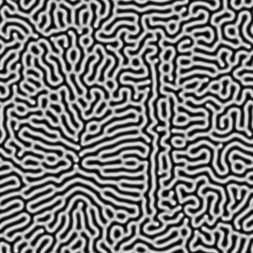

## Reaction Diffusion

Simple program to play around with the Gray Scott Reaction Diffusion model.

It's capable of both producing a video showing the overall simulation or simply to
save the image of the last generation.

```bash
$ cargo run --release -- --help
$ cargo run --release -- --iterations 1000 random
$ cargo run --release -- --speed 10 --iterations 6000 image data/logo.png
```


